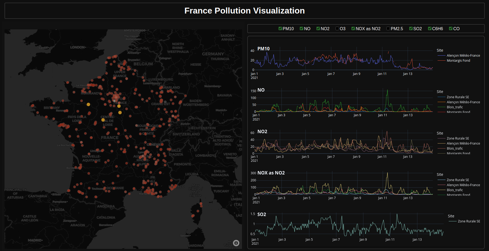

# France pollution visualization

This application is an easy to use visualization tool, allowing users to explore and compare pollution measurements in France.
With its intuitive interface, you can navigate in on a map of France, selecting one or multiple data points and inspecting the associated measurements. Filtering the wanted pollution types is as easy as toggling a checkbox.


*Screenshot of the app in use, with multiple data points selected, and only part of the polluants shown.*

## How to run it

Download the repo, install the python dependencies and run the script with the following commands:

```
git clone https://github.com/4str0m/PollutionVis.git
cd PollutionVis
pip install -r requirements.txt
python data_vis.py
```